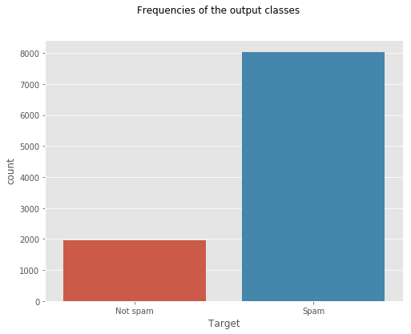
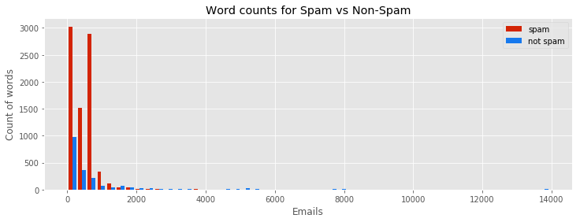

# Spam detection using Bag of Words(BoW)

## Problem setting
Train an email spam filter which should mark the incoming emails of all employees as spam or non-spam.
The emails are parsed by a module and converted into the bag-of-words representation.
A total of 57,173 different words (features) are distinguished. The aim of the filter is to
identify a maximum number of spam emails, with a maximum of 0.2% of all legitimate
emails being classified incorrectly. In addition, the company wants to make a statement
about the effectiveness of the filter on future emails, i.e., what percentage of incoming
spam emails will be identied in the future.

## Data exploration
- Frequencies of the classes

- Total Word count in emails spam vs not spam

- Frequencies of the words

## Data preprocessing
- Converted word count into TF-IDF
- Generated synthetic data using upsampling to balance the dataset

## Requirements
- Python (>=3.6)
- Seaborn
- Matplotlib
- Pandas
- Juypter notebook
- Numpy
- Pickle
